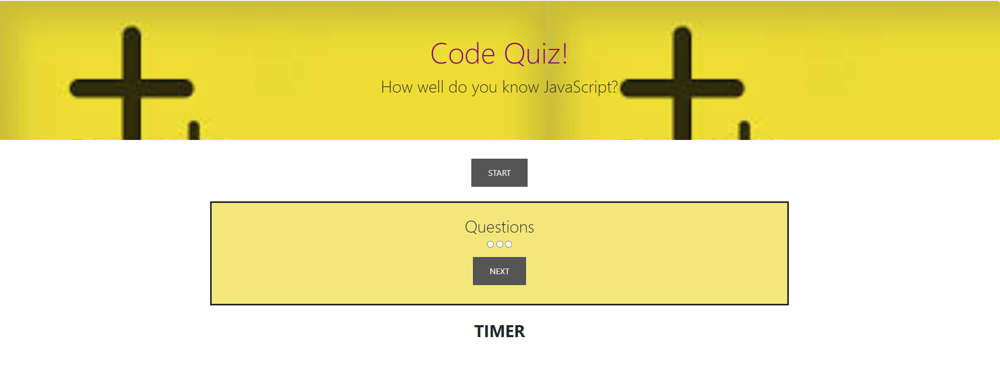

# Code Quiz

> AS A coding bootcamp student
  I WANT to take a timed quiz on JavaScript fundamentals that stores high scores
  SO THAT I can gauge my progress compared to my peers

---

### Table of Contents
You're section headers will be used to reference location and destination.

- [Description](#description)
- [Technologies](#technologies)
- [How To Use](#how-to-use)
- [License](#license)
- [Author Info](#author-info)

---

## Description

Simple Code Quiz build with JavaScript, HTML and CSS. Questions are rendered on the screen when you start the app, a timer runs simultaneoustly and a final score is given at the end. 

### Technologies

- JavaScript
- HTML
- CSS

## How to Use

Click the Start button, the quiz and timer will run as the questions are rendered to the screen, select your answers and your score is printed at the the very end or when the time runs out.

### License

Distributed under the MIT License. See LICENSE for more information.

[Back To The Top](#project-name)

---

## Author Info

Fatim Robbins
fmsis@hotmail.com